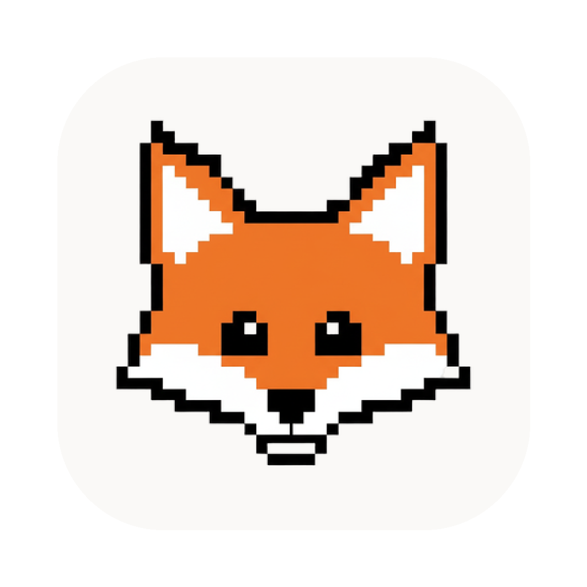

# Masko for Claude Code

A macOS menu bar companion for [Claude Code](https://claude.ai/code). A living animated mascot that floats above your windows, reacts to Claude Code's state, and lets you handle permission requests without leaving your terminal.



## Features

- **Animated overlay mascot** — floats above all windows, reacts to Claude Code state (idle, working, thinking, needs attention)
- **Permission handling** — approve or deny tool use requests from a speech bubble on the mascot, no window switching needed
- **AskUserQuestion support** — answer Claude's questions directly from the overlay
- **Plan mode** — review and approve plans from the overlay
- **Activity feed** — see all Claude Code hook events in real time
- **Session tracking** — monitor active sessions, subagents, and status
- **Notifications** — native macOS notifications for important events
- **Auto-updates** — built-in Sparkle updates

## Requirements

- macOS 14.0+
- Apple Silicon (arm64)
- [Claude Code](https://claude.ai/code) installed

## Install

Download the latest `.dmg` from [Releases](https://github.com/RousselPaul/masko-for-claude-code/releases).

## Build from Source

```bash
# Clone
git clone https://github.com/RousselPaul/masko-for-claude-code.git
cd masko-for-claude-code

# Build
swift build

# Run
swift run
```

## How It Works

1. On first launch, Masko installs a hook script into `~/.claude/settings.json`
2. Claude Code fires hook events (tool use, sessions, notifications, etc.)
3. The hook script sends events to Masko's local HTTP server on port 49152
4. Masko updates the mascot animation, shows permission prompts, and tracks sessions

## License

Copyright 2026 Masko. All rights reserved.
